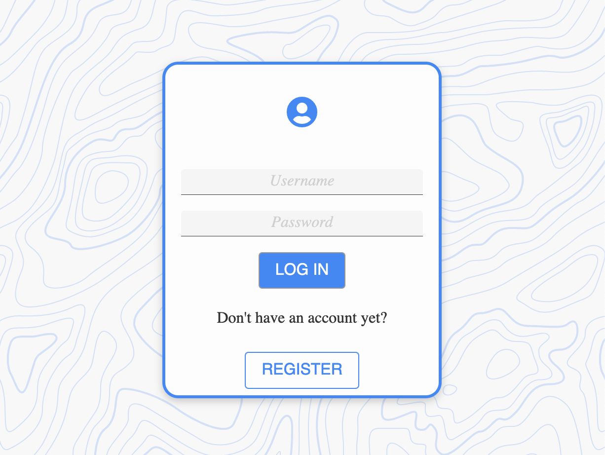
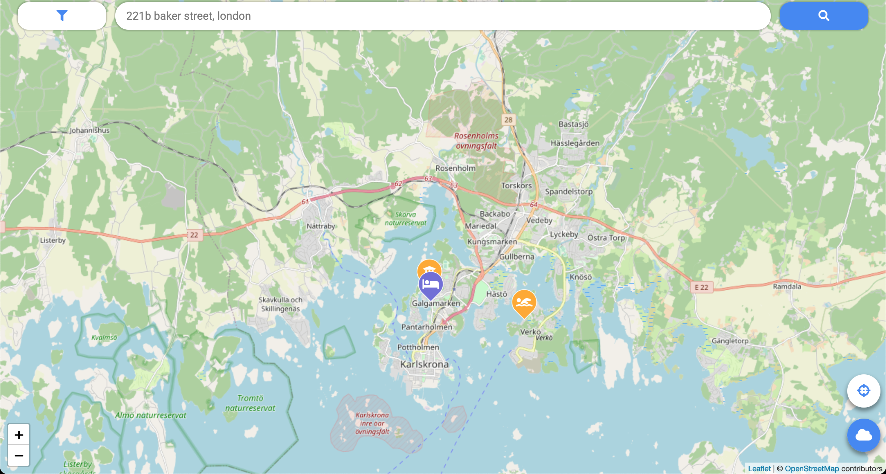
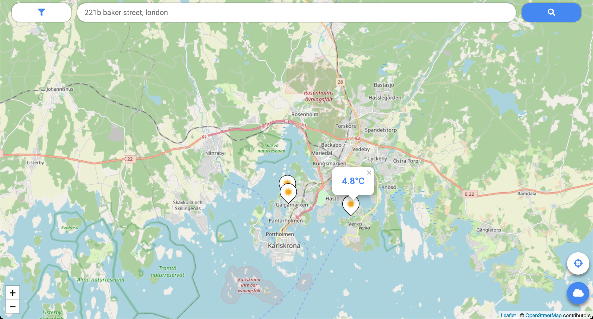

# MapBack

This is a [Django REST framework](https://www.django-rest-framework.org/) project that is to serve as an API where geographical locations and associated data can be stored, and is especially designed to work in tandem with the [MyMap](https://github.com/datalowe/mymap) frontend application (the example screenshots above are from MyMap).

For converting color hex codes to color names (when no custom color name is provided), the [colornames](https://github.com/rgson/python-colornames) library by [rgson](https://github.com/rgson/) is used. For weather data, MapBack queries the [Norwegian weather service YR's API](https://developer.yr.no/), caching the relevant data and providing an 'adapter' weather API tailored for MyMap.

This is a project developed for the course [Web Applications for Mobile Devices](https://www.bth.se/utbildning/program-och-kurser/kurser/20231/BJQE4/) at Blekinge Institute of Technology. You can [try out a demo of MyMap, using MapBack as a backend, here](https://www.student.bth.se/~loal20/dbwebb-kurser/webapp/me/kmom10/mymap). Log in in with username 'demouser' and password 'demopass' - you might need to wait 1-2 minutes for the login to succeed, as the MapBack deployment, served on Heroku, might have been idling. If you want to read about the project in detail, you can have a look at the report I created [here](https://www.student.bth.se/~loal20/dbwebb-kurser/webapp/me/redovisa/) (go to "Reports" and scroll all the way down to "Course project: MyMap").
